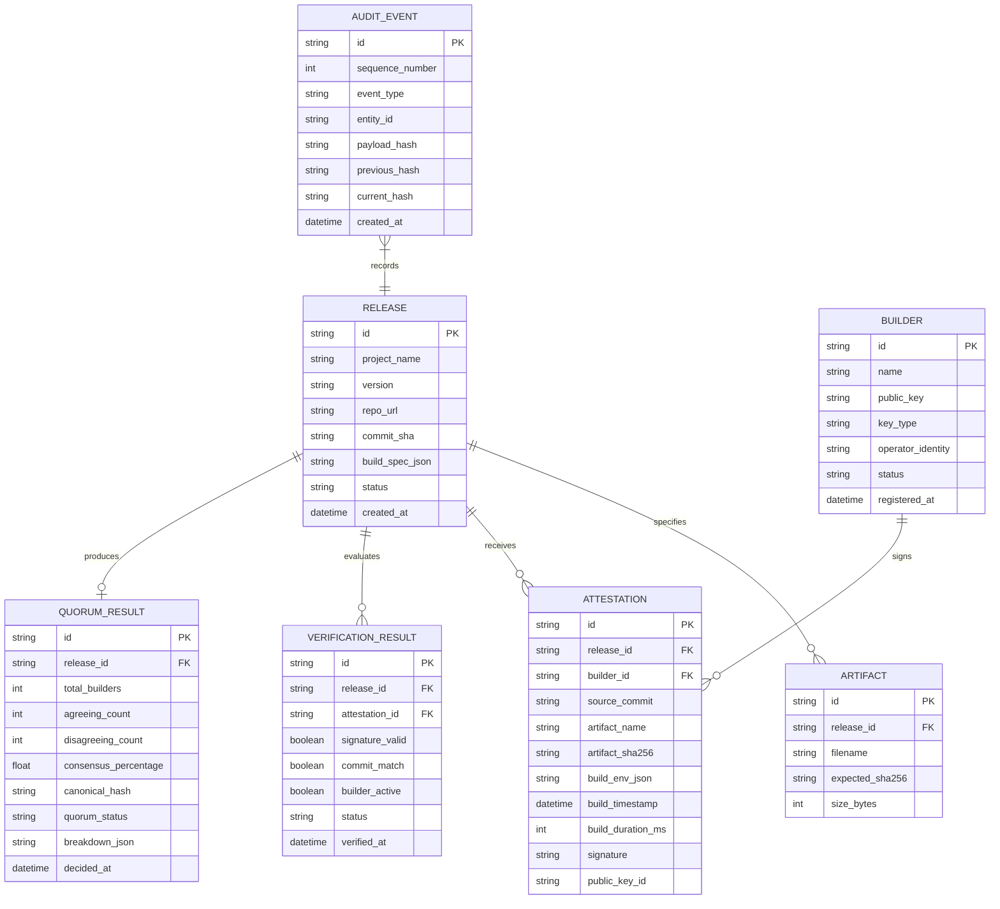
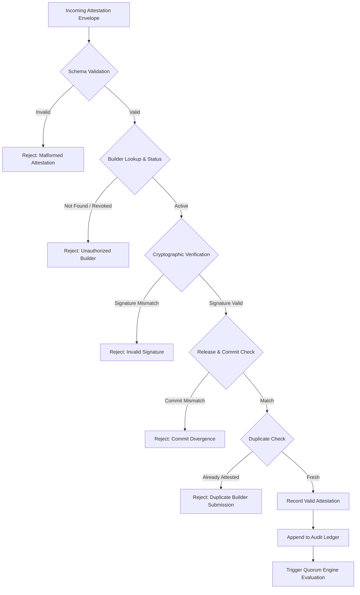
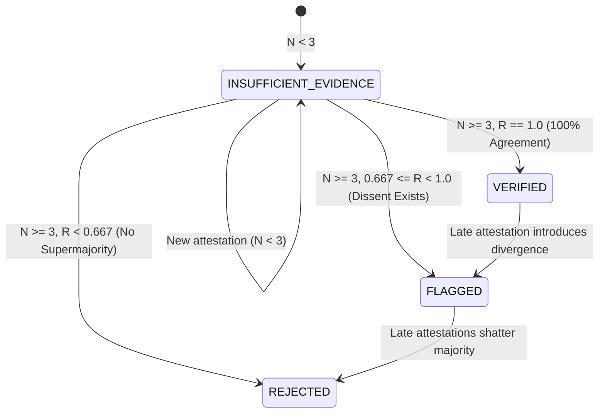
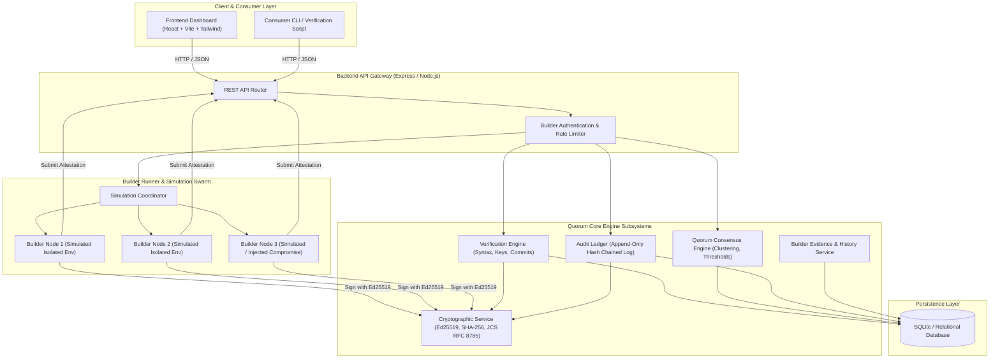

# Quorum — Technical Architecture & Implementation Plan
**"Don't Trust the Binary, Trust the Builders"**

---

## Executive Summary & Design Philosophy
Modern software ecosystems suffer from a profound asymmetry of trust: package managers and end-users download pre-compiled binary artifacts based solely on identity tokens, repository URLs, or maintainer signatures. If a build machine, maintainer account, or CI/CD runner is compromised (as observed in SolarWinds, Codecov, and the 2024 XZ Utils backdoor attempt), malicious instructions are embedded directly into binaries while the public source repository appears benign.

**Quorum** eliminates this blind trust by transitioning software distribution from single-source belief to **multi-party independent reproducible verification**. By having independent, heterogeneous builder nodes rebuild the exact source commit in clean deterministic environments, compute cryptographic SHA-256 digests, and publish signed cryptographic attestations, Quorum establishes an unforgeable consensus record. Disagreements are not swept under the rug—they are highlighted as potential supply-chain attacks.

---

## 1. PROJECT OVERVIEW

### 1.1 The Problem in Technical Terms
1. **Blind Binary Ingestion:** When a developer runs `npm install`, `pip install`, `cargo add`, or downloads a release archive from GitHub, they receive a compiled artifact (e.g., `.tar.gz`, `.whl`, `.node`, executable binary).
2. **The Source-Binary Gap:** There is zero cryptographic proof linking the binary byte-for-byte to the public Git commit hash (`git checkout <commit-sha>`).
3. **Attack Surfaces:**
   - **Compromised Build CI/CD:** Attackers inject shell scripts into GitHub Actions, CircleCI, or Jenkins runners that mutate the build output prior to publishing.
   - **Maintainer Account Takeover:** Attackers steal NPM/PyPI API tokens or SSH keys and publish a backdoored artifact directly to the registry.
   - **Rogue / Sleeper Maintainer (XZ Utils Attack Model):** A maintainer or compromised account commits legitimate code to Git, but injects malicious binary test payloads or autotools m4 scripts exclusively into the release tarball.
   - **Compiler/Toolchain Subversion (Ken Thompson Hack):** Malicious toolchains silently inject backdoors during compilation.

### 1.2 The Proposed Quorum Solution
Quorum creates a decentralized verification network:
1. When a maintainer publishes a release, a release declaration is registered containing the exact repository URL, Git commit SHA, and reproducible build specification.
2. A swarm of $N$ independent, heterogeneous builder nodes independently check out that exact Git commit SHA.
3. Each builder executes the build recipe in an isolated sandbox, produces the output artifact, and hashes it using SHA-256.
4. Each builder signs an **Attestation** containing the artifact hash, commit SHA, build environment metadata, and timestamp using its dedicated Ed25519 private key.
5. The **Verification Engine** cryptographically verifies the signatures and checks that all parameters match the release declaration.
6. The **Quorum Engine** analyzes hash distributions, detects consensus or divergences, and classifies the release into clear operational states: `VERIFIED`, `FLAGGED`, `REJECTED`, or `INSUFFICIENT_EVIDENCE`.
7. Every event is written to an **Append-Only, Hash-Chained Audit Log** (a Merkle-linked ledger), guaranteeing tamper-evidence without blockchain overhead.
8. Consumers and CI pipelines inspect the Quorum consensus before allowing artifact installation.

```
       [ Source Commit SHA ]
                 |
    +------------+------------+
    |            |            |
[Builder 1]  [Builder 2]  [Builder 3]
 (AWS Linux)  (GCP Debian) (Baremetal Arch)
    |            |            |
 Artifact     Artifact     Artifact
 (SHA-256)    (SHA-256)    (SHA-256)
    |            |            |
 Signed       Signed       Signed
Attestation  Attestation  Attestation
    \            |            /
     \           |           /
      v          v          v
   [ Quorum Verification Engine ]
                 |
      [ Consensus Evaluation ]
    (Consensus %, Divergences)
                 |
      +----------+----------+
      |                     |
 [Decision]         [Audit Ledger]
(VERIFIED / FLAGGED) (Hash-Chained Log)
      |
 [Consumer / CLI / Dashboard]
```

### 1.3 The Role of Independent Builders
Builders are autonomous, isolated nodes run by distinct individuals or organizations (e.g., community members, enterprise consumers, university research labs). Their sole responsibility is to act as **cryptographic witnesses**:
- They operate without shared administrative credentials.
- They run on diverse architectures and OS distributions to prevent homogeneous OS-level supply chain poisoning.
- They generate Ed25519 keypairs upon onboarding; only the public key is registered with Quorum.
- They have no authority to approve releases unilaterally; authority emerges strictly through mathematical agreement among independent builders.

---

## 2. CORE ACTORS

| Actor | Responsibilities | Security Posture / Trust Assumption |
| :--- | :--- | :--- |
| **Software Maintainer** | Author of the project. Pushes commits to public Git repositories, creates release tags, and supplies a deterministic build manifest (`quorum-build.json` or Dockerfile/script). | **Untrusted / Partially Trusted**. Maintainer credentials can be compromised, or a maintainer could attempt to distribute a rogue tarball differing from the Git commit. |
| **Source Repository** | Public Git hosting platform (GitHub, GitLab, self-hosted). Maintains commit history, cryptographic tree objects, and commit SHAs. | **Immutable Reference**. Commit SHAs are assumed cryptographically immutable (SHA-1/SHA-256 git objects). Quorum pins builds to exact commit SHAs, never mutable branch names (`main`, `v1.0`). |
| **Independent Builder** | Automated, isolated build agent that polls/receives build jobs, clones the commit SHA, executes the build recipe, computes artifact digests, and signs attestations. | **Zero-Trust individually; Trusted collectively**. Any single builder may be compromised, buggy, or malicious. Consensus ($M$ of $N$) protects the system. |
| **Verification Engine** | Backend service that accepts incoming builder attestations, validates cryptographic signatures against registered public keys, verifies commit matching, and checks duplicate submissions. | **Deterministic Computation**. Operates under strict cryptographic validation rules; does not make policy decisions, only mathematical verifications. |
| **Quorum Engine** | Consensus analysis subsystem that aggregates valid attestations for a given release, groups identical artifact hashes, calculates agreement percentages, and evaluates against release policies. | **Rule-based Consensus**. Implements deterministic threshold logic (`VERIFIED`, `FLAGGED`, `REJECTED`, `INSUFFICIENT_EVIDENCE`). |
| **Consumer** | Developers, DevOps engineers, package managers, and automated CI/CD pipelines deciding whether to download and execute a release artifact. | **Verifier of Proofs**. Queries Quorum API or CLI tool to inspect consensus proofs and builder signatures before trusting a binary. |
| **Auditor** | Security researcher or compliance auditor who inspects the immutable audit log to verify system integrity, builder reliability, and historical consensus events. | **Independent Verifier**. Can re-hash the entire audit chain from genesis to tip to prove no past events have been altered or deleted. |

---

## 3. CORE ENTITIES & DATA MODEL



### Entity Schema Definitions

1. **Release:**
   - `id`: UUIDv4 string (e.g., `rel_01J98X7...`).
   - `project_name`: String (e.g., `"openssl-lite"`, `"core-parser"`).
   - `version`: SemVer string (e.g., `"1.4.0"`).
   - `repo_url`: Public repository URL (e.g., `"https://github.com/example/project"`).
   - `commit_sha`: 40-character hexadecimal Git commit hash.
   - `build_spec`: JSON object detailing build commands, expected artifact path, and required toolchains.
   - `status`: Enum (`"PENDING"`, `"INSUFFICIENT_EVIDENCE"`, `"VERIFIED"`, `"FLAGGED"`, `"REJECTED"`).
   - `created_at`: ISO-8601 timestamp.

2. **Builder:**
   - `id`: Unique builder identifier (e.g., `"bld_node_alpha_us"`).
   - `name`: Human-readable name (e.g., `"US-East Builder (Debian 12)"`).
   - `public_key`: Base64/Hex encoded Ed25519 public key.
   - `key_type`: Cryptographic algorithm identifier (`"Ed25519"`).
   - `operator_identity`: Identity or organization operating the node (e.g., `"InfraTeam A"`, `"SecurityLab B"`).
   - `status`: Enum (`"ACTIVE"`, `"SUSPENDED"`, `"REVOKED"`).
   - `registered_at`: ISO-8601 timestamp.

3. **Artifact:**
   - `id`: UUIDv4 string.
   - `release_id`: Foreign key referencing `Release.id`.
   - `filename`: Standard filename (e.g., `"app-v1.4.0-linux-amd64.tar.gz"`).
   - `expected_sha256`: Optional maintainer-claimed SHA-256 hash.
   - `size_bytes`: Integer byte size.

4. **Attestation:**
   - `id`: Unique attestation identifier (e.g., `"att_01J98Y..."`).
   - `release_id`: Foreign key referencing `Release.id`.
   - `builder_id`: Foreign key referencing `Builder.id`.
   - `source_commit`: Hex commit hash checked out and built.
   - `artifact_name`: Filename of the compiled binary.
   - `artifact_sha256`: Computed SHA-256 checksum of the output.
   - `build_env`: JSON object of environment properties (OS, arch, compiler version, `SOURCE_DATE_EPOCH`).
   - `build_timestamp`: Timestamp when the build was executed.
   - `build_duration_ms`: Duration in milliseconds.
   - `signature`: Base64-encoded Ed25519 signature over the canonicalized attestation payload.
   - `public_key_id`: Key identifier used to verify the signature.

5. **Verification Result:**
   - `id`: UUIDv4 string.
   - `release_id`: FK to `Release.id`.
   - `attestation_id`: FK to `Attestation.id`.
   - `signature_valid`: Boolean flag (true if Ed25519 signature verifies).
   - `commit_match`: Boolean flag (true if attestation commit == release commit).
   - `builder_active`: Boolean flag (true if builder is registered and not revoked).
   - `status`: `"VALID"` or `"INVALID"`.
   - `verified_at`: ISO-8601 timestamp.

6. **Quorum Result:**
   - `id`: UUIDv4 string.
   - `release_id`: FK to `Release.id`.
   - `total_builders`: Total verified builder attestations considered ($N$).
   - `agreeing_count`: Number of builders matching the dominant hash ($M$).
   - `disagreeing_count`: Number of builders producing divergent hashes ($N - M$).
   - `consensus_percentage`: Float representing $(M / N) \times 100$.
   - `canonical_hash`: The majority agreed SHA-256 digest (if consensus reached).
   - `quorum_status`: Enum (`"VERIFIED"`, `"FLAGGED"`, `"REJECTED"`, `"INSUFFICIENT_EVIDENCE"`).
   - `breakdown_json`: Full cluster breakdown linking builder IDs to respective hashes.
   - `decided_at`: ISO-8601 timestamp.

7. **Audit Event:**
   - `id`: UUIDv4 string.
   - `sequence_number`: Monotonically increasing 64-bit integer ($0, 1, 2, \dots$).
   - `event_type`: Enum (`"GENESIS"`, `"RELEASE_REGISTERED"`, `"BUILDER_REGISTERED"`, `"ATTESTATION_RECORDED"`, `"QUORUM_EVALUATED"`, `"BUILDER_REVOKED"`).
   - `entity_id`: ID of the primary associated entity.
   - `payload_hash`: SHA-256 of the event data payload.
   - `previous_hash`: SHA-256 of the preceding audit event (`"00000..."` for sequence 0).
   - `current_hash`: $\text{SHA-256}(\text{sequence\_number} \parallel \text{timestamp} \parallel \text{event\_type} \parallel \text{entity\_id} \parallel \text{payload\_hash} \parallel \text{previous\_hash})$.
   - `created_at`: ISO-8601 timestamp.

---

## 4. ATTESTATION DESIGN

### 4.1 Attestation Payload Structure
To avoid serialization ambiguities and signature validation failures across different runtimes, Quorum follows the **RFC 8785 JSON Canonicalization Scheme (JCS)**.

The attestation is divided into two parts:
1. **The Canonical Statement (Payload)**: All claims made by the builder.
2. **The Envelope**: The metadata, key reference, and cryptographic signature.

#### Canonical Statement JSON Schema:
```json
{
  "$schema": "https://quorum.dev/schemas/v1/attestation-statement.json",
  "statement_version": "1.0.0",
  "attestation_id": "att_01J98Y7Z3K001",
  "release_id": "rel_01J98X7A9C000",
  "builder_id": "bld_node_alpha_us",
  "public_key_id": "key_ed25519_node_alpha",
  "source": {
    "repo_url": "https://github.com/example/cryptolib",
    "commit_sha": "d670460b4b4aece5915caf5c68d12f560a9fe3e4"
  },
  "artifact": {
    "name": "cryptolib-v1.4.0-linux-amd64.tar.gz",
    "sha256": "8f434346648f6b96df89dda901c5176b10f607662cee1b3ec12e8b1e5bda7439",
    "size_bytes": 2490368
  },
  "build_environment": {
    "os": "linux-ubuntu-22.04",
    "arch": "x86_64",
    "kernel": "5.15.0-89-generic",
    "compiler": "gcc-11.4.0",
    "reproducible_flags": {
      "SOURCE_DATE_EPOCH": 1700000000,
      "LANG": "C.UTF-8",
      "TZ": "UTC",
      "UMASK": "0022"
    }
  },
  "build_metadata": {
    "build_timestamp": "2026-10-03T11:15:30Z",
    "build_duration_ms": 18450,
    "build_log_sha256": "4a5b6c7d8e9f0123456789abcdef0123456789abcdef0123456789abcdef0123"
  }
}
```

#### Envelope Structure (Stored and Transmitted):
```json
{
  "attestation_id": "att_01J98Y7Z3K001",
  "statement": { "... canonical statement as above ..." },
  "signature_envelope": {
    "algorithm": "Ed25519",
    "public_key_id": "key_ed25519_node_alpha",
    "signature": "z3A7...base64_encoded_ed25519_signature...=="
  }
}
```

### 4.2 Cryptographic Signing & Verification Details
1. **What is signed?**
   - The exact UTF-8 byte representation of the **RFC 8785 canonicalized statement**.
   - Canonicalization ensures:
     - Lexicographically sorted dictionary keys.
     - No extraneous whitespace or newlines.
     - Uniform floating point / integer representations.
     - Deterministic character escaping.
2. **Algorithm Choice:**
   - **Ed25519 (EdDSA over Curve25519)**.
   - *Rationale:* Superior resistance to side-channel attacks, deterministic signatures (no risk of bad random nonces leaking private keys like ECDSA), small 64-byte signatures, high verification speed, and native support in Node.js `crypto` and the Web Crypto API.
3. **Signing Process (Builder Side):**
   $$\text{canonical\_bytes} = \text{RFC8785\_Canonicalize}(\text{statement})$$
   $$\text{signature} = \text{Ed25519\_Sign}(\text{private\_key}, \text{canonical\_bytes})$$
4. **Verification Process (Verification Engine Side):**
   - Retrieve `statement` from payload.
   - Run `RFC8785_Canonicalize(statement)` to obtain bit-exact byte sequence.
   - Fetch public key corresponding to `builder_id` from the registered builder store.
   - Call $\text{Ed25519\_Verify}(\text{public\_key}, \text{canonical\_bytes}, \text{signature})$.
   - If invalid, mark attestation as `"CRYPTOGRAPHIC_SIGNATURE_FAILURE"` and reject immediately.

---

## 5. VERIFICATION ENGINE

The Verification Engine runs deterministically whenever a builder submits an attestation, or when a manual verification sweep is triggered.



### Step-by-Step Verification Pipeline

1. **Step 1: Structural & Schema Validation**
   - Check presence of all required fields (`attestation_id`, `release_id`, `builder_id`, `source.commit_sha`, `artifact.sha256`, `signature_envelope.signature`).
   - Verify SHA-256 regex format: `^[a-f0-9]{64}$`.
   - Verify Git commit SHA regex format: `^[a-f0-9]{40}$`.

2. **Step 2: Builder Identity & Key Lookup**
   - Query `builders` table by `builder_id`.
   - Ensure builder exists and `status == 'ACTIVE'`. If `SUSPENDED` or `REVOKED`, reject attestation.
   - Confirm `public_key_id` in envelope matches the registered active public key.

3. **Step 3: Cryptographic Signature Verification**
   - Serialize `statement` via RFC 8785 canonicalization.
   - Verify Ed25519 signature against registered `public_key`.
   - If verification returns `false`, log security warning: `"BUILDER_SIGNATURE_MISMATCH"`, record verification failure, and stop.

4. **Step 4: Release & Source Commit Consistency**
   - Query `releases` table by `release_id`.
   - Compare `statement.source.commit_sha` with `release.commit_sha`.
   - If they do not match, the builder built an unauthorized or different commit. Mark as invalid.

5. **Step 5: Duplicate Attestation Detection**
   - Ensure the builder has not previously submitted an attestation for this specific `release_id`.
   - Reject duplicate submissions to prevent replay or multi-vote poisoning attacks.

6. **Step 6: Recording & Audit Emission**
   - Insert row into `attestations` and `verification_results`.
   - Emit `ATTESTATION_RECORDED` event to the append-only audit ledger.
   - Dispatch event to trigger the Quorum Engine.

---

## 6. QUORUM LOGIC

### 6.1 Quorum Formulation & Mathematical Rules
Let:
- $N$ = Total number of verified, cryptographically valid builder attestations for a given release.
- $H = \{h_1, h_2, \dots, h_N\}$ = Multiset of artifact SHA-256 hashes submitted by the builders.
- Distinct hash clusters $C_k = \{b \in \text{Builders} \mid \text{hash}(b) = h_k\}$.
- Dominant cluster $C_{\text{maj}}$ = cluster with the maximum cardinality $M = \max_k |C_k|$.
- Consensus ratio: $R = \frac{M}{N}$.
- $\text{MIN\_BUILDERS} = 3$ (Default minimum independent builders required to form a valid quorum).
- $\text{QUORUM\_THRESHOLD} = 0.667$ ($\ge 66.7\%$, representing a supermajority).

### 6.2 Decision States



#### Detailed State Transition Criteria:

1. **`INSUFFICIENT_EVIDENCE`:**
   - Condition: $N < \text{MIN\_BUILDERS}$ (fewer than 3 valid builder attestations).
   - *Technical Justification:* A single builder or two builders cannot provide sufficient fault tolerance against Byzantine or compromised nodes. The release cannot be recommended for installation yet.

2. **`VERIFIED` (Unanimous Consensus):**
   - Condition: $N \ge \text{MIN\_BUILDERS}$ AND $R = 1.0$ (100% agreement, zero disagreements).
   - *Meaning:* All participating independent builders compiled the identical commit and produced bit-identical output. The canonical hash is certified.

3. **`FLAGGED` (Majority Consensus with Active Dissent):**
   - Condition: $N \ge \text{MIN\_BUILDERS}$ AND $R \ge \text{QUORUM\_THRESHOLD}$ BUT $R < 1.0$.
   - *Example:* 2 out of 3 builders agree on `Hash_A`, 1 builder produces `Hash_B` ($R = 66.7\%$).
   - *Crucial Rule:* **Disagreements must NEVER be hidden.**
   - *Action:* The release receives status `FLAGGED`. The UI and API explicitly display:
     - Majority canonical hash: `Hash_A` (held by Builder 1, Builder 2).
     - Conflicting hash: `Hash_B` (held by Builder 3).
     - Warning message: *"Quorum achieved majority (66.7%), but active disagreement detected. Possible supply-chain tampering on Builder 3, or build non-determinism."*

4. **`REJECTED` (Consensus Failure / Broken Quorum):**
   - Condition: $N \ge \text{MIN\_BUILDERS}$ AND $R < \text{QUORUM\_THRESHOLD}$.
   - *Example:* 3 builders produce 3 different hashes (`Hash_A`, `Hash_B`, `Hash_C` $\implies R = 33.3\%$), or 4 builders split 2 vs 2 ($R = 50\%$).
   - *Action:* Release is marked `REJECTED`. No canonical hash is certified. Package managers configured with Quorum enforcement MUST block installation.

### 6.3 Explainable Quorum Output Schema
Every quorum result generates a transparent explanation object:
```json
{
  "release_id": "rel_01J98X7A9C000",
  "status": "FLAGGED",
  "summary": "Majority consensus reached (66.7%), but 1 builder produced a conflicting artifact hash.",
  "metrics": {
    "total_valid_builders": 3,
    "agreeing_builders_count": 2,
    "disagreeing_builders_count": 1,
    "consensus_percentage": 66.67,
    "threshold_required_percentage": 66.67
  },
  "canonical_hash": "8f434346648f6b96df89dda901c5176b10f607662cee1b3ec12e8b1e5bda7439",
  "clusters": [
    {
      "hash": "8f434346648f6b96df89dda901c5176b10f607662cee1b3ec12e8b1e5bda7439",
      "builder_count": 2,
      "percentage": 66.67,
      "builders": ["bld_node_alpha_us", "bld_node_beta_eu"],
      "classification": "MAJORITY_CONSENSUS"
    },
    {
      "hash": "c9284201824ef98028a110294723bb0204859aef902847285a83749281749283",
      "builder_count": 1,
      "percentage": 33.33,
      "builders": ["bld_node_gamma_apac"],
      "classification": "DISSENTING"
    }
  ]
}
```

---

## 7. TRUST ASSESSMENT (EVIDENCE-BASED)

### 7.1 Rejection of Opaque / Arbitrary "Trust Scores"
Quorum does **not** use arbitrary "star ratings", "reputation tokens", or subjective points. Instead, trust in a builder is an empirical, observable calculation derived strictly from verifiable historical records stored in the tamper-evident audit ledger.

### 7.2 Observable Evidence Metrics
For every builder $B_i$, the system aggregates:
1. **Total Attestations Submitted ($T_i$):** Total build jobs processed.
2. **Valid Cryptographic Signatures ($V_i$):** Attestations with mathematically valid signatures.
3. **Signature Failures ($F_i$):** Attestations rejected due to invalid signature math (indicates key corruption or forged submissions).
4. **Consensus Alignment Count ($A_i$):** Number of times $B_i$'s artifact hash matched the final certified canonical hash.
5. **Divergence Count ($D_i$):** Number of times $B_i$'s artifact hash contradicted the majority consensus.
6. **Consensus Alignment Rate ($CAR_i$):**
   $$CAR_i = \frac{A_i}{A_i + D_i} \times 100\%$$

### 7.3 Builder Health Classifications

| Health Status | Empirical Criteria | Operational Impact |
| :--- | :--- | :--- |
| **RELIABLE** | $T_i \ge 5$, $CAR_i \ge 95\%$, $F_i = 0$ | Full weight in quorum computations. |
| **EVALUATING** | $T_i < 5$, $F_i = 0$ | New node. Attestations counted, but marked as probationary in inspection view. |
| **DEGRADED** | $80\% \le CAR_i < 95\%$, $F_i = 0$ | Warning indicator. Likely running slight toolchain variations or unpinned library versions. |
| **SUSPICIOUS** | $CAR_i < 80\%$ OR $F_i \ge 1$ | High rate of conflict or any signature failure. Flagged for review. |
| **REVOKED** | Proven key compromise or malicious backdoor injection | Node excluded from quorum calculations; past attestations marked with caveat. |

---

## 8. TAMPER-RESISTANT AUDIT LOG

### 8.1 Hash-Chained Linear Ledger (Merkle-Linked Audit Log)
To avoid the unnecessary latency, gas fees, and consensus overhead of a blockchain while retaining **cryptographic tamper-evidence**, Quorum implements an append-only, Merkle-linked audit log patterned after RFC 6962 (Certificate Transparency).

Each log entry is linked to the previous entry via its SHA-256 hash:

```
[ Genesis Event #0 ]
  hash_0 = SHA-256(seq:0, type:"GENESIS", prev:"000000...")
        ^
        | previous_hash = hash_0
[ Event #1: RELEASE_REGISTERED ]
  payload_hash_1 = SHA-256(release_json)
  hash_1 = SHA-256(seq:1, type:"RELEASE", payload:payload_hash_1, prev:hash_0)
        ^
        | previous_hash = hash_1
[ Event #2: ATTESTATION_RECORDED ]
  payload_hash_2 = SHA-256(attestation_json)
  hash_2 = SHA-256(seq:2, type:"ATTESTATION", payload:payload_hash_2, prev:hash_1)
        ^
        | previous_hash = hash_2
[ Event #3: QUORUM_EVALUATED ]
  payload_hash_3 = SHA-256(quorum_json)
  hash_3 = SHA-256(seq:3, type:"QUORUM", payload:payload_hash_3, prev:hash_2)
```

### 8.2 Hash Derivation Formula
For sequence $k$:
$$\text{payload\_hash}_k = \text{SHA-256}(\text{CanonicalJSON}(\text{event\_payload}))$$
$$\text{current\_hash}_k = \text{SHA-256}(k \parallel \text{timestamp}_k \parallel \text{event\_type}_k \parallel \text{entity\_id}_k \parallel \text{payload\_hash}_k \parallel \text{previous\_hash}_k)$$

For sequence 0 (Genesis):
$$\text{previous\_hash}_0 = \text{"0000000000000000000000000000000000000000000000000000000000000000"}$$

### 8.3 Tamper Detection Mechanism
Suppose an adversary with direct database access alters an earlier attestation or quorum decision at Sequence 2 to conceal a rogue build hash:
1. Modifying the row at sequence 2 changes its computed $\text{payload\_hash}_2$.
2. Consequently, $\text{current\_hash}_2$ changes from $h_2$ to $h_2'$.
3. However, Event 3 was recorded with $\text{previous\_hash}_3 = h_2$.
4. When any auditor, dashboard, or consumer runs the verification audit loop:
   - It re-hashes each event from 0 to $K$.
   - At sequence 3, $\text{previous\_hash}_3 \neq \text{recomputed\_hash}_2$.
   - **TAMPER DETECTED:** The system immediately flags the exact sequence number where the break occurred and alerts the user that historical integrity has been violated.

---

## 9. SECURITY MODEL & THREAT ANALYSIS

| Threat Identifier & Vector | Attack Description | Quorum Defense & Mitigation Strategy |
| :--- | :--- | :--- |
| **T1: Compromised Builder Node** | An adversary compromises one builder node and silently injects a trojan into its compiled binary. | **Quorum Consensus Requirement ($M \ge 2/3$):** A single rogue builder will produce a hash that diverges from honest nodes. Quorum marks the release as `FLAGGED` or `REJECTED`, alerts consumers, and exposes the compromised builder's identity. |
| **T2: Compromised Maintainer Account** | An attacker steals maintainer PyPI/NPM credentials and uploads a backdoored `.whl` or `.tgz` directly to the registry. | **Independent Git Commit Checkout:** Independent builders do not download the registry tarball; they check out the source code at the public Git commit SHA and build it from source. The maintainer's backdoored binary hash will not match the Quorum canonical hash, causing package managers to reject it. |
| **T3: XZ Utils Style Sleeper Maintainer** | A rogue maintainer adds malicious build modifications exclusively inside the release tarball while keeping the Git commit clean. | **Source-Only Builds:** Because builders only execute against Git commit SHAs, the rogue tarball's hash diverges completely from the builder consensus hash. Verification fails. |
| **T4: Modified Artifact Post-Build** | A mirror, CDN, or proxy modifies the binary file while serving it to end-users. | **Client-Side SHA-256 Comparison:** The Quorum CLI or consumer client hashes the downloaded binary locally and compares it with the Quorum canonical hash. Any in-transit tampering is caught instantly before execution. |
| **T5: Forged Attestation** | An attacker fabricates an attestation claiming a backdoored hash was verified by Builder Alpha. | **Asymmetric Ed25519 Signatures:** The Verification Engine verifies the signature against Builder Alpha's registered public key. Without Builder Alpha's private key, the signature is mathematically invalid. |
| **T6: Replay Attack** | An attacker takes a valid attestation from Release v1.0 and resubmits it for a backdoored Release v2.0. | **Commit & Release Binding:** The signed statement includes both the unique `release_id` and `source.commit_sha`. Replaying on a different release or commit causes an immediate `COMMIT_MISMATCH` rejection. |
| **T7: Sybil Attack (Duplicate Builder Identities)** | An attacker spins up 100 fake builder nodes on AWS to overwhelm the 2/3 quorum threshold. | **Permissioned Builder Registry:** For the MVP, builder registration requires explicit operator identity verification and public key pinning. A single operator cannot control $> 1/3$ of the active quorum nodes. |
| **T8: Compromised Private Signing Key** | A builder node's private Ed25519 key is exfiltrated by an attacker. | **Key Revocation & Ledger Auditing:** The operator publishes a key revocation event. All subsequent attestations are rejected. Past attestations signed after the compromised timestamp are flagged for re-verification by unaffected builders. |
| **T9: Build Non-Determinism (False Dissent)** | Unpinned timestamps, file ordering, or compiler versions cause honest builders to produce different hashes. | **Deterministic Build Specification:** Build recipes enforce `SOURCE_DATE_EPOCH`, `TZ=UTC`, `umask 0022`, and sorted directory tarballs (`--sort=name`). If non-determinism still occurs, Quorum marks the release as `REJECTED` or `FLAGGED`, alerting developers that their build is not reproducible. |
| **T10: Database Tampering by Insider** | A malicious database administrator alters stored attestation records to make a backdoored release appear `VERIFIED`. | **Hash-Chained Audit Ledger:** Any modification to past database rows breaks the cryptographic chain links ($\text{current\_hash}_k \neq \text{previous\_hash}_{k+1}$). The frontend and client CLI detect the chain break upon loading. |

---

## 10. DEMO SCENARIOS

The system must demonstrate four concrete, reproducible scenarios that directly validate the security architecture.

### SCENARIO A: Valid Reproducible Release (Clean Consensus)
- **Source:** Project `libsecure-auth` at commit `d670460b`.
- **Builder 1 (Ubuntu 22.04):** Produces artifact `libsecure-auth.bin` $\implies$ Hash: `8f434346648f6b96df89dda901c5176b10f607662cee1b3ec12e8b1e5bda7439`.
- **Builder 2 (Debian 12):** Produces artifact `libsecure-auth.bin` $\implies$ Hash: `8f434346648f6b96df89dda901c5176b10f607662cee1b3ec12e8b1e5bda7439`.
- **Builder 3 (Alpine Linux):** Produces artifact `libsecure-auth.bin` $\implies$ Hash: `8f434346648f6b96df89dda901c5176b10f607662cee1b3ec12e8b1e5bda7439`.
- **Verification Engine:** All 3 signatures valid, commit hashes match.
- **Quorum Engine:** 3/3 builders agree (100.0% consensus).
- **Outcome:** Status = **`VERIFIED`**. Green verification badge, canonical hash certified, audit log updated.

### SCENARIO B: Compromised Builder / Backdoor Attempt (Visible Disagreement)
- **Source:** Project `net-proxy-service` at commit `a1b2c3d4`.
- **Builder 1 (Honest):** Produces Hash `7a9e01...`
- **Builder 2 (Honest):** Produces Hash `7a9e01...`
- **Builder 3 (Compromised / Backdoored):** Build runner simulates an injected shell payload, modifying a byte in the compiled binary $\implies$ Produces Hash `3b1c8f...`
- **Verification Engine:** All 3 signatures mathematically valid.
- **Quorum Engine:**
  - 2 builders agree on `7a9e01...` (66.7%).
  - 1 builder produced divergent `3b1c8f...` (33.3%).
- **Outcome:** Status = **`FLAGGED`**.
- **Crucial UI Representation:**
  - System displays prominent warning: *"Quorum Majority Achieved, but 1 Builder Disagreed!"*
  - Shows visual side-by-side comparison of Builder 1 & 2 vs. Builder 3.
  - Highlights the differing SHA-256 hash.
  - Demonstrates that Quorum refuses to silently conceal builder conflict.

### SCENARIO C: Non-Deterministic Build / No Consensus (Quorum Failure)
- **Source:** Project `image-renderer` at commit `f5e4d3c2`.
- **Builder 1:** Uses unpinned timestamp $\implies$ Hash: `11111111...`
- **Builder 2:** Uses local system timezone $\implies$ Hash: `22222222...`
- **Builder 3:** Uses non-deterministic compiler output $\implies$ Hash: `33333333...`
- **Quorum Engine:** 3 builders, 3 distinct hashes (Max consensus = 33.3%, below 66.7% threshold).
- **Outcome:** Status = **`REJECTED`** (or `NO_CONSENSUS`).
- **Explanation:** *"Build non-deterministic or heavily compromised. Quorum rejected the release. Do not install."*

### SCENARIO D: Forged / Tampered Attestation (Cryptographic Signature Failure)
- **Source:** Project `crypto-vault` at commit `e8d7c6b5`.
- **Attack Simulation:** An attacker intercepts an attestation envelope in transit or directly edits the database to alter the recorded hash from `4444...` to `9999...` without having Builder 1's Ed25519 private key.
- **Verification Engine:** Re-computes RFC 8785 canonical bytes, calls `crypto.verify(publicKey, canonicalBytes, signature)`.
- **Result:** **Verification Fails (`SIGNATURE_VERIFICATION_FAILURE`)**.
- **Outcome:** The forged attestation is rejected with zero trust credit. Alert recorded in the audit log.

---

## 11. SYSTEM ARCHITECTURE

### 11.1 Component-Level Architecture



### 11.2 Component Communication Details
1. **Frontend / CLI to Backend:** Standard RESTful JSON over HTTP.
2. **Builder Runner to Backend:** Simulates independent builder daemons. In the hackathon MVP, the backend includes a builder runner module capable of running real local deterministic builds or scripted deterministic builds with simulated environment variance (e.g. injecting modified bytes in Scenario B).
3. **Internal Subsystems:** Pure in-process TypeScript service calls for low-latency, strictly typed guarantees.
4. **Cryptographic Engine:** Uses native Node.js `crypto` primitives for Ed25519 key generation, digital signing, signature verification, and SHA-256 calculations.
5. **Database Interaction:** Synchronous/async queries via SQLite (`better-sqlite3` or `sqlite3`), guaranteeing atomic transactions for audit ledger appending.

---

## 12. TECHNOLOGY RECOMMENDATION

### Selected Stack for Hackathon MVP

| Tier | Recommended Technology | Technical Justification |
| :--- | :--- | :--- |
| **Frontend** | **React 18 + Vite + TypeScript + Tailwind CSS** | Blazing-fast development cycle, rich reactive UI, type-safe data fetching, easy component composition for consensus graphs and diff tables. |
| **UI Components & Icons** | **Lucide React + clsx / tailwind-merge** | Clean, modern cybersecurity aesthetic (dark mode, crisp status badges, terminal-like audit log). |
| **Backend API** | **Node.js (v20+) + Express + TypeScript** | Native support for ES modules, robust HTTP ecosystem, excellent developer velocity. |
| **Cryptographic Engine** | **Node.js `crypto` module (built-in)** | Native OpenSSL-backed implementation of **Ed25519** (`crypto.sign`, `crypto.verify`, `crypto.generateKeyPairSync`) and **SHA-256**. Zero third-party cryptographic vulnerabilities. |
| **Canonicalization** | **RFC 8785 JSON Canonicalization (JCS)** | Deterministic serialization without whitespace or key-order ambiguity, essential for signature verification. |
| **Database** | **SQLite (via `better-sqlite3` or `sqlite3`)** | Zero external service setup required (no Docker or cloud dependency required to run the demo locally). ACID compliant, file-backed, easily inspectable, handles transactions cleanly. |
| **Testing** | **Vitest / Jest + Supertest** | Fast unit and integration tests for cryptographic validation and quorum logic. |

---

## 13. DATABASE SCHEMA (DDL)

```sql
-- Builders Registry
CREATE TABLE IF NOT EXISTS builders (
    id TEXT PRIMARY KEY,
    name TEXT NOT NULL,
    public_key TEXT NOT NULL,
    key_type TEXT NOT NULL DEFAULT 'Ed25519',
    operator_identity TEXT NOT NULL,
    status TEXT NOT NULL CHECK(status IN ('ACTIVE', 'SUSPENDED', 'REVOKED')),
    registered_at TEXT NOT NULL DEFAULT (datetime('now'))
);

-- Releases Table
CREATE TABLE IF NOT EXISTS releases (
    id TEXT PRIMARY KEY,
    project_name TEXT NOT NULL,
    version TEXT NOT NULL,
    repo_url TEXT NOT NULL,
    commit_sha TEXT NOT NULL,
    build_spec_json TEXT NOT NULL,
    expected_artifact_name TEXT NOT NULL,
    expected_hash TEXT,
    status TEXT NOT NULL CHECK(status IN ('PENDING', 'INSUFFICIENT_EVIDENCE', 'VERIFIED', 'FLAGGED', 'REJECTED')),
    created_at TEXT NOT NULL DEFAULT (datetime('now'))
);

-- Attestations Table
CREATE TABLE IF NOT EXISTS attestations (
    id TEXT PRIMARY KEY,
    release_id TEXT NOT NULL REFERENCES releases(id),
    builder_id TEXT NOT NULL REFERENCES builders(id),
    source_commit TEXT NOT NULL,
    artifact_name TEXT NOT NULL,
    artifact_sha256 TEXT NOT NULL,
    build_env_json TEXT NOT NULL,
    build_timestamp TEXT NOT NULL,
    build_duration_ms INTEGER NOT NULL,
    build_log_sha256 TEXT NOT NULL,
    statement_json TEXT NOT NULL,
    signature TEXT NOT NULL,
    public_key_id TEXT NOT NULL,
    is_valid BOOLEAN NOT NULL DEFAULT 0,
    validation_error TEXT,
    created_at TEXT NOT NULL DEFAULT (datetime('now')),
    UNIQUE(release_id, builder_id)
);

-- Verification Results Table
CREATE TABLE IF NOT EXISTS verification_results (
    id TEXT PRIMARY KEY,
    release_id TEXT NOT NULL REFERENCES releases(id),
    attestation_id TEXT NOT NULL REFERENCES attestations(id),
    signature_valid BOOLEAN NOT NULL,
    commit_match BOOLEAN NOT NULL,
    builder_active BOOLEAN NOT NULL,
    status TEXT NOT NULL CHECK(status IN ('VALID', 'INVALID')),
    notes TEXT,
    verified_at TEXT NOT NULL DEFAULT (datetime('now'))
);

-- Quorum Results Table
CREATE TABLE IF NOT EXISTS quorum_results (
    id TEXT PRIMARY KEY,
    release_id TEXT NOT NULL UNIQUE REFERENCES releases(id),
    total_builders INTEGER NOT NULL,
    agreeing_count INTEGER NOT NULL,
    disagreeing_count INTEGER NOT NULL,
    consensus_percentage REAL NOT NULL,
    canonical_hash TEXT,
    quorum_status TEXT NOT NULL CHECK(quorum_status IN ('INSUFFICIENT_EVIDENCE', 'VERIFIED', 'FLAGGED', 'REJECTED')),
    breakdown_json TEXT NOT NULL,
    decided_at TEXT NOT NULL DEFAULT (datetime('now'))
);

-- Tamper-Resistant Audit Events Table
CREATE TABLE IF NOT EXISTS audit_events (
    id TEXT PRIMARY KEY,
    sequence_number INTEGER UNIQUE NOT NULL,
    event_type TEXT NOT NULL,
    entity_id TEXT NOT NULL,
    payload_hash TEXT NOT NULL,
    previous_hash TEXT NOT NULL,
    current_hash TEXT NOT NULL,
    created_at TEXT NOT NULL DEFAULT (datetime('now'))
);

-- Indices for performance
CREATE INDEX IF NOT EXISTS idx_attestations_release ON attestations(release_id);
CREATE INDEX IF NOT EXISTS idx_audit_seq ON audit_events(sequence_number);
```

---

## 14. API DESIGN

### RESTful Endpoints Specification

#### Releases & Verification
- `POST /api/releases`
  - Register a new release intent.
  - Body: `{ projectName, version, repoUrl, commitSha, expectedArtifactName, buildSpec }`
  - Response: `201 Created` with full release object.
- `GET /api/releases`
  - List all releases with their current quorum status and builder counts.
- `GET /api/releases/:id`
  - Detailed release info, expected artifact, current quorum consensus, and builder breakdown.
- `POST /api/releases/:id/trigger-builds`
  - Initiates the independent builder swarm simulation to clone, build, hash, and submit attestations for the release.
  - Body: `{ scenario?: 'NORMAL' | 'COMPROMISED_BUILDER' | 'NO_CONSENSUS' | 'TAMPERED_SIG' }`
- `POST /api/releases/:id/evaluate-quorum`
  - Re-runs the Quorum Engine over all valid attestations and updates release status.
- `GET /api/releases/:id/quorum`
  - Returns current consensus percentage, dominant hash, and detailed disagreement list.

#### Attestations & Builders
- `POST /api/attestations`
  - Submit a signed attestation from a builder.
  - Body: `{ statement: {...}, signatureEnvelope: { algorithm, publicKeyId, signature } }`
  - Response: `201 Created` with verification result (`signature_valid`, `commit_match`).
- `GET /api/releases/:id/attestations`
  - List all attestations for a given release, including validity flags and raw signatures.
- `GET /api/builders`
  - List all registered builders, public keys, operational status, and empirical trust statistics.
- `GET /api/builders/:id`
  - Deep-dive into builder performance history ($T, V, A, D, CAR$).

#### Audit Log & Tamper Verification
- `GET /api/audit-trail`
  - Returns paginated list of audit events with sequence numbers, hashes, and linked payloads.
- `POST /api/audit-trail/verify`
  - Runs full cryptographic chain verification from sequence 0 to tip.
  - Returns: `{ isValid: true, totalEvents: 42, tipHash: "..." }` or `{ isValid: false, brokenSequence: 14, expectedPrev: "...", actualPrev: "..." }`.
- `POST /api/demo/simulate-tamper`
  - Developer/demo endpoint that deliberately mutates a past audit entry to visually demonstrate tamper detection during presentations.

---

## 15. FRONTEND PAGES & UI SPECIFICATION

1. **Dashboard (`/`)**
   - High-level overview: Total releases verified, consensus rate across network, active builder nodes count, recent release feed.
   - Quick Demo Scenario Launcher: 1-click execution cards for Scenario A (Clean), Scenario B (Compromised Builder), Scenario C (No Consensus), and Scenario D (Signature Forgery).

2. **Release Verification & Consensus View (`/releases/:id`)**
   - **Consensus Gauge & Status Banner:** Giant badge displaying `VERIFIED` (Green), `FLAGGED` (Amber), `REJECTED` (Red), or `INSUFFICIENT EVIDENCE` (Slate).
   - **Consensus Bar:** Visual bar showing agreement percentage (e.g., 66.7% vs 33.3%).
   - **Builder Hash Matrix:** Side-by-side builder cards detailing:
     - Builder Name & Region
     - Artifact SHA-256 (highlighted green for majority, red for divergent)
     - Ed25519 Signature status (Valid / Invalid)
     - Build environment chips (OS, GCC, Duration)
   - **Disagreement Inspector:** If `FLAGGED`, a dedicated alert box explicitly explaining: *"1 out of 3 builders generated a conflicting binary. Inspection recommended before deployment."*

3. **Release Registry (`/releases`)**
   - Filterable list of all tracked releases, searchable by project name, commit SHA, or status.

4. **Builder Network & Evidence Explorer (`/builders`)**
   - Directory of registered builder nodes.
   - Detailed evidence metrics: Total builds, consensus alignment rate ($CAR$), divergence count, public key fingerprint.
   - Status toggle: View active vs suspended builders.

5. **Attestation Deep Inspector (`/attestations/:id`)**
   - Raw JSON viewer for canonical statements.
   - Cryptographic signature debugger: Displays canonical byte string, public key, and signature verification outcome.

6. **Tamper-Resistant Audit Trail (`/audit`)**
   - Visual chain-of-blocks rendering each event connected to its predecessor by cryptographic hashes.
   - **"Verify Audit Trail Integrity" Button:** Re-hashes the chain live in the browser, showing progress and giving an instantaneous green audit certificate or red tamper alert.

---

## 16. MVP SCOPE

### MUST HAVE (Core Hackathon Deliverables)
- [x] Real cryptographic key generation (Ed25519) and signing/verification using Node.js `crypto`.
- [x] RFC 8785 JSON canonicalization implementation for deterministic signing payloads.
- [x] True SHA-256 calculation of simulated or actual binary artifacts (no mocked hashes).
- [x] 3 independent simulated builder agents capable of running builds and producing attestations.
- [x] Full Verification Engine pipeline (schema, key lookup, signature check, commit match).
- [x] Quorum Engine with clear classification logic (`VERIFIED`, `FLAGGED`, `REJECTED`, `INSUFFICIENT_EVIDENCE`).
- [x] Explicit disagreement detection and side-by-side conflicting hash visualization.
- [x] Append-only, Merkle-linked audit log with live tamper detection verification tool.
- [x] All 4 demonstration scenarios runnable with 1 click from the UI or API.
- [x] Polished, dark-themed responsive dashboard built with React + Vite + Tailwind CSS.

### SHOULD HAVE
- [ ] Client CLI script (`quorum-verify <release-id> <downloaded-binary-path>`) that verifies local binaries against Quorum.
- [ ] Live log streaming during builder execution.
- [ ] Downloadable SLSA v1.0 / in-toto compatible provenance JSON file.

### NICE TO HAVE
- [ ] Docker-in-Docker real container builds for arbitrary GitHub repositories.
- [ ] Real-time WebSocket updates when attestations arrive.
- [ ] Cross-platform compilation comparison (x86_64 vs ARM64).

### NOT REQUIRED FOR MVP
- Distributed P2P consensus networks (Libp2p, Tendermint).
- Blockchain / Web3 smart contracts / crypto tokens.
- Heavy cloud infrastructure orchestration (Kubernetes clusters).

---

## 17. IMPLEMENTATION PHASES


### Phase 1: Architecture & Data Modeling (Complete with this document)
- Define schemas, interfaces, mathematical models, and threat analysis.

### Phase 2: Cryptographic Utilities & Canonicalization
- Implement Ed25519 key generation, sign, and verify helpers in Node.js.
- Implement RFC 8785 JSON Canonicalization Scheme (JCS).
- Implement SHA-256 digest computation helpers.
- Unit test key generation and verification roundtrips.

### Phase 3: Database & Persistence Layer
- Set up SQLite schema with `better-sqlite3` or `sqlite3`.
- Write CRUD helpers for builders, releases, attestations, and audit events.
- Implement atomic transactions for audit ledger insertion.

### Phase 4: Builder Swarm Simulation
- Build independent builder agent simulation module.
- Provision 3 default builder identities (Alpha-US, Beta-EU, Gamma-APAC) with persistent Ed25519 keypairs.
- Support deterministic build execution (producing bit-identical tarballs or binaries) and inject-mode execution (injecting byte mutations to simulate backdoors).

### Phase 5: Verification Engine
- Implement the 6-step verification pipeline.
- Ensure malformed signatures, altered commits, or unknown keys are rejected with clear diagnostics.

### Phase 6: Quorum Engine
- Implement hash clustering algorithm.
- Calculate consensus percentage and apply thresholds ($N \ge 3$, $66.7\%$).
- Formulate the detailed explainable breakdown with active disagreement reporting.

### Phase 7: Tamper-Resistant Audit Ledger
- Implement the hash-chained event logger ($H_k = \text{SHA256}(k, \text{prev}, \text{payload})$).
- Implement the audit verification algorithm that traverses the chain and detects unauthorized database edits.

### Phase 8: REST API Gateway
- Build Express router for all endpoints.
- Add scenario runner endpoints (`/api/demo/run-scenario/:id`).

### Phase 9: Frontend Dashboard & Visualizations
- Initialize Vite + React + TypeScript + Tailwind project.
- Build Dashboard, Consensus Matrix, Disagreement Viewer, Builder Directory, and Audit Chain Explorer.
- Integrate 1-click Demo Scenario trigger cards.

### Phase 10: Attack Demonstrations & Chaos Scenarios
- Wire Scenarios A, B, C, and D into end-to-end executable flows.
- Add tamper simulation button on the Audit page to demonstrate chain breakage.

### Phase 11: End-to-End Testing & Security Audit
- Run test suites verifying cryptographic correctness.
- Validate that no hardcoded hashes or fake consensus checks exist.

---

## 18. TESTING STRATEGY

### 18.1 Unit Tests
- **Crypto Suite:**
  - Verify that Ed25519 signature fails if even a single bit of the canonical statement is altered.
  - Verify that RFC 8785 canonicalization produces identical byte outputs regardless of key order in JSON objects.
  - Verify SHA-256 hashing matches known OpenSSL vectors.
- **Quorum Suite:**
  - 3 matching hashes $\implies$ 100% agreement, `VERIFIED`.
  - 2 matching, 1 divergent $\implies$ 66.7% agreement, `FLAGGED`, list 1 disagreeing builder.
  - 3 different hashes $\implies$ 33.3%, `REJECTED`.
  - 1 or 2 attestations $\implies$ `INSUFFICIENT_EVIDENCE`.
- **Audit Ledger Suite:**
  - Sequence continuity test ($k = k-1 + 1$).
  - Tamper detection test: artificially edit sequence 2, assert verify function returns `isValid: false` at sequence 3.

### 18.2 Integration Tests
- Full release lifecycle: `Create Release` $\to$ `Run 3 Builders` $\to$ `Submit Attestations` $\to$ `Verify Signatures` $\to$ `Compute Quorum` $\to$ `Verify Audit Ledger Entry`.

### 18.3 Security & Negative Tests
- Attempt to submit an attestation with a revoked builder ID (assert rejection).
- Attempt to submit an attestation with a mismatched commit SHA (assert rejection).
- Attempt to submit an attestation with a malformed Ed25519 signature (assert rejection).
- Attempt duplicate attestation from the same builder (assert rejection).

---

## 19. FINAL DEMO FLOW (3–5 MINUTE SCRIPT)

| Time | Stage | Action & Visuals | Key Narrative / Takeaway |
| :--- | :--- | :--- | :--- |
| **0:00 - 0:45** | **The Hook: The XZ Utils Crisis** | Show the problem slide / dashboard intro. Explain that modern package managers blindly trust pre-compiled binaries. | *"You trust the Git commit, but what built your binary? A compromised maintainer or CI server can inject a backdoor that never appears in Git."* |
| **0:45 - 1:45** | **Scenario A: Clean Consensus** | Click **"Run Scenario A (Valid Release)"**. Watch 3 builders compile commit `d670460b`. Attestations arrive in real time. | *"3 independent builders on different platforms built the exact same commit. All 3 produced hash `8f43...`. Quorum calculates 100% consensus: release is VERIFIED."* |
| **1:45 - 3:00** | **Scenario B: The Compromised Builder Attack** | Click **"Run Scenario B (Injected Backdoor)"**. Builder 3 is compromised and injects a single byte into the binary. | *"Look at the consensus view! Builder 1 & 2 agree on `7a9e...`, but Builder 3 produced `3b1c...`. Quorum does not hide this! It marks the release as FLAGGED, highlights Builder 3's divergence, and warns the user."* |
| **3:00 - 3:45** | **Scenario D: Signature Tampering** | Click **"Run Scenario D (Tampered Signature)"**. An attacker intercepts an attestation and edits the hash in transit. | *"The Verification Engine evaluates the Ed25519 signature against the builder's registered public key. The mathematical check fails instantly. Zero trust is granted."* |
| **3:45 - 4:30** | **Audit Trail Integrity & Tamper Proof** | Navigate to the **Audit Trail** page. Click **"Simulate Database Tampering"** to modify an old row. Click **"Verify Chain Integrity"**. | *"Notice the chain break at Sequence #4! Because every event is cryptographically linked to the previous one, any unauthorized database tampering is detected immediately without needing a slow blockchain."* |
| **4:30 - 5:00** | **Conclusion & Vision** | Show the Consumer CLI or verification badge. | *"Quorum moves software supply chain security from blind trust in single maintainers to verifiable consensus among independent builders."* |

---

## APPENDIX

### A. Recommended Final Tech Stack
- **Monorepo / Directory Layout:** Single repository with `client/` and `server/` folders for seamless local execution.
- **Backend:** Node.js (v20+), Express, TypeScript, `better-sqlite3` (or `sqlite3`), native `crypto`.
- **Frontend:** React 18, Vite, TypeScript, Tailwind CSS, Lucide React.
- **Tooling:** `npm workspaces` or standard concurrent scripts (`npm run dev` running both server and client).

### B. Proposed Folder Structure
```
quorum/
├── PROJECT_PLAN.md
├── package.json                 # Root script coordinator
├── server/
│   ├── package.json
│   ├── tsconfig.json
│   └── src/
│       ├── index.ts             # Express server entry point
│       ├── config.ts            # System parameters & constants
│       ├── crypto/
│       │   ├── keys.ts          # Ed25519 keygen & key management
│       │   ├── canonicalize.ts  # RFC 8785 JSON canonicalizer
│       │   ├── signer.ts        # Attestation signing logic
│       │   └── verifier.ts      # Signature verification logic
│       ├── db/
│       │   ├── database.ts      # SQLite connection & migration runner
│       │   └── schema.sql       # DDL table definitions
│       ├── models/              # TypeScript interfaces & types
│       ├── services/
│       │   ├── verification.service.ts # 6-step attestation verification
│       │   ├── quorum.service.ts       # Hash clustering & threshold rules
│       │   ├── audit.service.ts        # Append-only hash chain ledger
│       │   └── builder-swarm.service.ts # Builder simulation & attack modes
│       └── routes/
│           ├── releases.routes.ts
│           ├── attestations.routes.ts
│           ├── builders.routes.ts
│           ├── audit.routes.ts
│           └── demo.routes.ts   # Scenario triggers
└── client/
    ├── package.json
    ├── vite.config.ts
    ├── tailwind.config.js
    └── src/
        ├── App.tsx
        ├── main.tsx
        ├── api/                 # Axios / fetch client hooks
        ├── components/          # Reusable UI components (ConsensusGauge, HashBadge, AuditCard)
        └── pages/
            ├── Dashboard.tsx    # Overview & 1-click scenario triggers
            ├── ReleaseView.tsx  # Detailed consensus matrix & disagreement view
            ├── BuilderList.tsx  # Builder network & evidence tracking
            └── AuditTrail.tsx   # Visual blockchain-style hash chain inspector
```

### C. Implementation Order
1. **Repository Setup:** Initialize root `package.json`, `server/`, and `client/`.
2. **Cryptographic Core (`server/src/crypto`):** Ed25519 signing, verification, and canonicalization.
3. **Database & Schema (`server/src/db`):** Initialize SQLite tables and indices.
4. **Audit Ledger Service (`server/src/services/audit.service.ts`):** Build the hash-chained event logger with integrity verification.
5. **Builder Swarm & Attestation Simulation (`server/src/services/builder-swarm.service.ts`):** Generate 3 builder keypairs and deterministic build pipelines.
6. **Verification Engine (`server/src/services/verification.service.ts`):** Validate incoming attestations.
7. **Quorum Engine (`server/src/services/quorum.service.ts`):** Hash clustering, agreement percentages, and disagreement detection.
8. **Express REST API (`server/src/routes`):** Wire all endpoints and the scenario controller.
9. **Frontend Dashboard & Pages (`client/`):** Implement the React views with Tailwind CSS and Lucide icons.
10. **Demo Scenario Integration:** Implement Scenarios A, B, C, and D end-to-end.
11. **Verification & Testing:** Verify mathematical correctness, signature verification, and chain integrity.

### D. Risks and Unresolved Technical Decisions
1. **Local Deterministic Build Complexity:**
   - *Risk:* Compiling real C or Rust projects during a 3-minute hackathon demo may take minutes or fail due to host-dependent toolchains.
   - *Resolution:* Implement a deterministic sample project (e.g., a self-contained C program or Go binary with fixed `SOURCE_DATE_EPOCH`), paired with a robust mockable simulation runner that computes true SHA-256 hashes of actual pre-built binary variants while running real cryptographic signing on the fly.
2. **SQLite Concurrency for Audit Log:**
   - *Risk:* High concurrency could cause lock contention or sequence gaps in the hash chain.
   - *Resolution:* SQLite transactions in `WAL` mode or an in-memory sequential event queue guarantee serialized append-only log ordering.

### E. Questions That Must Be Answered Before Coding Begins
1. **Should the builder simulation compile real source files locally during the demo, or simulate the compilation step by hashing prepared deterministic binary assets?**
   - *Recommendation:* Support both! Provide realistic simulated deterministic artifacts with real on-the-fly hashing and real cryptographic signing, plus an optional script to compile a small C/Go test file.
2. **What default threshold should be required for `VERIFIED`?**
   - *Recommendation:* Require 100% agreement ($R = 1.0$) with $N \ge 3$ for `VERIFIED`, and classify any agreement where $0.667 \le R < 1.0$ as `FLAGGED` to ensure disagreements are never concealed.
3. **Is SQLite acceptable for the hackathon MVP, or is an external PostgreSQL instance preferred?**
   - *Recommendation:* SQLite (`better-sqlite3`) is strongly recommended for the hackathon MVP because it runs instantaneously on any laptop without requiring database servers, credentials, or network configuration, while providing full SQL ACID guarantees.
